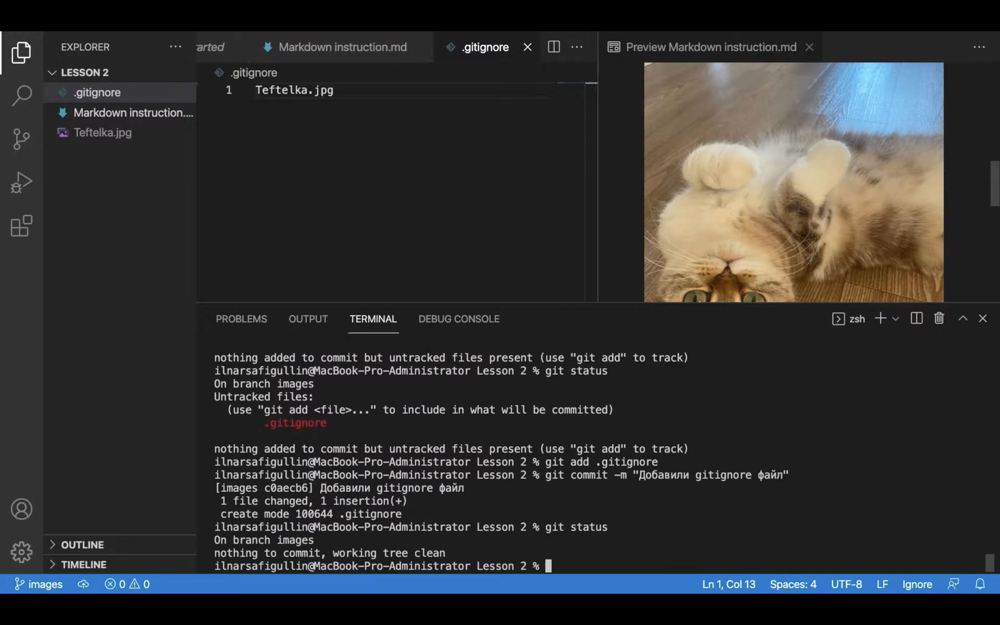

# Краткое введение по инструкции языка Markdown

* Жирный текст — **
* Курсивный текст — *
* Зачеркнутый текст — ~
* Выделяют заголовки в начале строки #
* Показать уровень заголовка — подчеркивание знаками = или -

Нумерованные списки делаются следующим образом: wwwwww
1. Нумерованные Списки — обозначаются обычными цифрами 1, 2, 3
2. Ненумерованные Списки — обозначаются знаками 
в начале строки
3. Вложенные Списки — выполняем отступы

Чтобы вставить изображение нужно написать, например: 

## Основные команды для начала работы с Git

1. *git init* - создание репозитория контроля версий в папке
2. **git add** - добавление нового файла или файла с изменениями в коммит
3. *git commit* - запись текущего состояния файла
4. **git diff** - показать внесения с новым коммитом изменения
5. *git log* - показать список коммитов

### Дополнительные действия

**Ссылка на полезные ресурсы и полную инструкцию:**
https://proglib.io/p/git-for-half-an-hour?

Тест для пулла из гитхаба в локальный репозиторий.

Клонирование репозитория осуществляется командой git clone <url>. Например, если вы хотите клонировать библиотеку libgit2, вы можете сделать это следующим образом:
  $ git clone https://github.com/libgit2/libgit2
