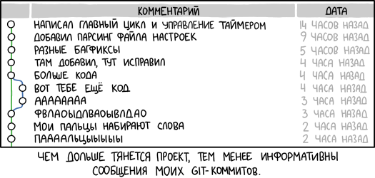

# Руководство по работе с Git

## Установка

* Скачать и установить **Git Bash**.
* Ввести команды, чтобы "представится Git'у:
1. git config --global user.name "Ваше Имя"
2. git config --global user.email "ВашаПочта@mail.com"

## Базовые команды Git

* **git init** - Создать пустой репозиторий Git или вновь инициализировать существующий. При инициализации создаётся скрытая папка '.git'. В ней содержатся все объекты и ссылки, которые Git использует и создаёт в истории работы над проектом.
* **git add имяФайла.расширение** - Добавить отдельный файл в область подготовленных файлов.
* **git commit -m ""** - Берёт файлы из области подготовленных файлов и “фиксирует” их в Ваш локальный репозиторий.
* **git log** - Вывод истории коммитов
* **git status** - Просмотреть статус репозитория, действие команды распространяется на подготовленные, неподготовленные и неотслеживаемые файлы.

## Работа с ветками

* **git branch названиеВетки** - Создает новую ветку - точную копию Ваших файлов.
* **git checkout “названиеВетки”** - Позволит Вам переключить контроль над созданной Вами веткой и работать в её пределах.
* **git merge названиеВетки** - Находясь в Master(главной) ветви, Вы можете использовать эту команду, чтобы взять коммиты из любой из ветвей и соединить их вместе.
* **git branch -d названиеВетки** - удалить ветку

## Git + GitHub

* **git clone ссылка** - клонирование репозитория в текущий каталог
* **git push** - отправка изменений на удаленный репозиторий
* **git pull** - получение обновлений с удаленного репозитория

## История создания Git

Разработка ядра Linux велась на проприетарной системе BitKeeper, которую автор — Ларри Маквой, сам разработчик Linux — предоставил проекту по бесплатной лицензии. Разработчики, высококлассные программисты, написали несколько утилит, и для одной Эндрю Триджелл произвёл реверс-инжиниринг формата передачи данных BitKeeper. В ответ Маквой обвинил разработчиков в нарушении соглашения и отозвал лицензию, и Торвальдс взялся за новую систему: ни одна из открытых систем не позволяла тысячам программистов кооперировать свои усилия (тот же конфликт привёл к написанию Mercurial). Идеология была проста: взять подход CVS и перевернуть с ног на голову, и заодно добавить надёжности.
Начальная разработка велась меньше, чем неделю: 3 апреля 2005 года разработка началась, и уже 7 апреля код Git управлялся неготовой системой. 16 июня Linux был переведён на Git, а 25 июля Торвальдс отказался от обязанностей ведущего разработчика.